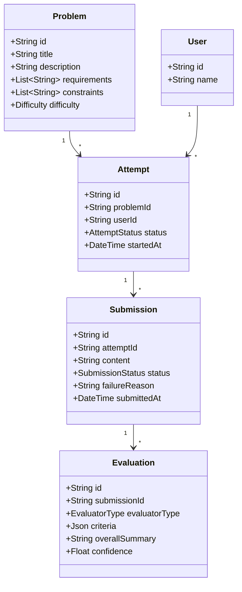

# Design Note: Architecture & Technical Decisions

**Assignment Deliverable — LLD Practice Platform**  
**Author:** Candidate  
**Date:** September 2026  

---

## 1. Executive Summary & MVP Scope

The **LLD Practice Platform** is built to solve the feedback vacuum in Low-Level Design practice. The MVP delivers an end-to-end learner journey:
```
[Choose Problem] ➔ [Design in Studio] ➔ [Submit] ➔ [Dual Evaluation] ➔ [Rubric Scorecard] ➔ [Retry & Compare]
```

To prioritize domain modeling and pedagogical value within a 2-day scope, the architecture adheres to a clean, modular monolith with distinct domain boundaries, repository abstraction, and a pluggable evaluation pipeline.

---

## 2. Core Domain Model & Class Responsibilities

The system is organized around five primary domain entities:



### Key Class Responsibilities

| Class / Interface | Responsibility | Invariants & Behaviors |
| :--- | :--- | :--- |
| `Problem` | Owns the problem statement, explicit functional requirements, constraints, and difficulty level. | Immutable per attempt; acts as the specification against which designs are evaluated. |
| `Attempt` | Represents a learner's focused practice session for a specific problem. | State transitions: `IN_PROGRESS` → `SUBMITTED`. Tracks duration and groups multiple submissions/iterations. |
| `Submission` | An immutable snapshot of the learner's submitted design content. | Owns its evaluation lifecycle: `PENDING` → `EVALUATING` → `COMPLETED` / `FAILED`. Guarantees auditability. |
| `Evaluator` (Interface) | Defines the contract `evaluate(submission): Promise<EvaluationResult>`. | Decouples the submission from how it is scored. Enables multiple evaluators to run independently. |
| `EvaluationOrchestrator`| Coordinates running one or more evaluators, handling timeouts/errors, and persisting structured results. | Ensures idempotency, catches evaluator crashes, and transitions submission states reliably. |

---

## 3. Evaluation Approach: Hybrid Deterministic + AI Rubric

Rather than asking an LLM an unconstrained question like *"Is this design good?"* (which yields subjective, unrepeatable scores), our platform employs a **two-tier hybrid strategy**:

### Tier 1: Deterministic Evaluator (`DeterministicEvaluator`)
- **Role**: Fast, rule-based verification of structural completeness.
- **Checks**:
  - Presence of core design sections: Requirements analysis, Class definitions, Responsibilities, Relationships/Patterns, and Edge cases.
  - Class naming patterns and interface keywords (`interface`, `abstract`, `implements`, `extends`).
  - Edge case awareness (concurrency, validation, failure modes).
- **Benefit**: 100% reproducible, zero latency, runs offline, eliminates LLM cost for incomplete drafts.

### Tier 2: AI Evaluator (`AIEvaluator`)
- **Role**: Deep architectural reasoning and nuance detection.
- **Rubric Dimensions (1–5 scale each)**:
  1. *Requirement Understanding*: Coverage of explicit requirements.
  2. *Class & Interface Design*: Single Responsibility Principle (SRP), appropriate encapsulation.
  3. *Coupling & Cohesion*: Dependency inversion, loose coupling, modularity.
  4. *Appropriate Abstraction & Patterns*: Strategy, Factory, Observer applied appropriately without over-engineering.
  5. *Extensibility & Edge Cases*: Ability to support new variants (e.g. new vehicle types or payment methods) without modifying core classes.
- **Strict Output Contract**: Enforces structured JSON:
  ```json
  {
    "criteria": [
      {
        "criterion": "Class & Interface Design",
        "score": 4,
        "evidence": "Separated Vehicle into abstract base with Car/Truck subclasses",
        "concern": "ParkingLot directly instantiates payment gateway",
        "suggestion": "Introduce PaymentProcessor interface for Dependency Inversion"
      }
    ],
    "overallSummary": "Solid domain model with clear spot allocation logic.",
    "confidence": 0.88
  }
  ```
- **Resilience Fallback**: If `OPENAI_API_KEY` is missing or the network fails, `AIEvaluator` falls back to an internal heuristic parser ensuring zero user downtime.

---

## 4. Architectural Change Tests

The architecture was deliberately designed to pass the two critical change tests defined in the assignment specification:

### Change Test A: Moving from Text to Class Diagrams / Code
> *"Today the learner submits text. Later the platform supports a class diagram or executable code. How much of your domain model changes?"*

- **Impact on Domain Model: ZERO.**
  - `Submission.content` is modeled as a payload container. A future submission type can either contain a serialized JSON diagram (e.g. Mermaid/PlantUML syntax or node graph) or code files.
  - The `Evaluator` interface accepts `Submission`. A new `DiagramEvaluator` or `CodeCompilerEvaluator` simply implements the existing `Evaluator` interface:
    ```typescript
    export interface Evaluator {
      evaluate(submission: Submission): Promise<EvaluationResult>;
    }
    ```
  - Neither `Problem`, `Attempt`, nor `Evaluation` entities need schema alterations. Only a diagram renderer component in the frontend and a diagram-aware evaluator implementation are added.

### Change Test B: Adding Rule-Based Evaluators or Human Mentorship
> *"Today feedback comes from one evaluator. Later you add a rule-based evaluator or human review. Can you add it without rewriting the practice flow?"*

- **Impact on Practice Flow: ZERO.**
  - The system already models `Evaluation` as a 1-to-many relationship with `Submission`:
    ```prisma
    model Evaluation {
      submissionId  String
      evaluatorType EvaluatorType // DETERMINISTIC | AI | HUMAN | COMPILER
      criteria      Json
    }
    ```
  - The `EvaluationOrchestrator` uses a pipeline pattern. Adding a `HumanReviewEvaluator` is as simple as registering a new worker that posts an `Evaluation` record when a mentor finishes grading. The learner's UI reads `submission.evaluations` dynamically without code changes.

---

## 5. Practical Scaling & Failure Tolerance

Following the assignment's guidance to avoid unnecessary distributed complexity, we solved reliability through clean software patterns:

1. **Decoupled Submission from Evaluation**:
   - When a user submits, the `Submission` is written to the database with status `PENDING` before evaluation begins.
   - The user immediately receives `201 Created` with `submissionId`.
   - The evaluation runs asynchronously (or in a background worker), transitioning status: `PENDING` ➔ `EVALUATING` ➔ `COMPLETED` (or `FAILED`).
2. **Evaluator Isolation**:
   - `EvaluationOrchestrator` wraps each evaluator in isolated `try/catch` blocks. A failure in the AI model (e.g. OpenAI rate limit or timeout) will not crash the server and will record `failureReason` on the submission while preserving deterministic feedback.
3. **Idempotent Retries**:
   - The submission is immutable. If a learner retries or resubmits, a distinct `Submission` is created under the existing `Attempt`, preserving historical attempts and preventing race conditions.
